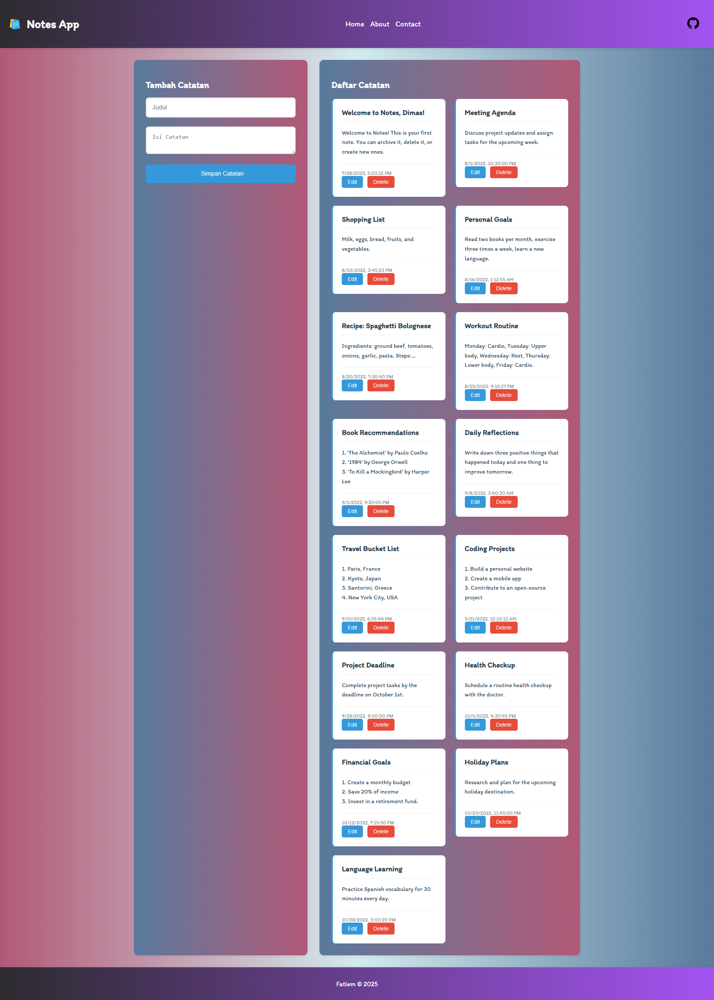

# 📝 Notes App

Selamat datang di **Notes App**! Aplikasi ini dirancang untuk membantu Anda membuat, mengelola, dan menyimpan catatan dengan mudah. Anda dapat menambahkan catatan baru, mengedit, dan menghapus catatan yang sudah ada.

## 🎯 Fitur Utama

- **🆕 Tambah Catatan**: Masukkan judul dan isi catatan baru.
- **✏️ Edit Catatan**: Ubah isi catatan yang sudah ada.
- **🗑️ Hapus Catatan**: Hapus catatan yang tidak lagi diperlukan.
- **📜 Daftar Catatan**: Lihat semua catatan yang telah Anda buat dalam satu tempat.
- **📱 Responsif**: Antarmuka yang responsif untuk berbagai ukuran layar.

## 📸 Tampilan Notes App

## 🛠️ Bahasa yang Digunakan

- **HTML**: Struktur dasar aplikasi.
- **CSS**: Styling untuk tampilan yang menarik.
- **JavaScript**: Logika aplikasi dan manipulasi DOM.

## 📖 Cara Menggunakan

1. **Menambahkan Catatan**:
   - Isi form dengan judul dan isi catatan.
   - Klik tombol "Simpan Catatan".

2. **Mengedit Catatan**:
   - Klik tombol "Edit" di samping catatan yang ingin diubah.
   - Ubah judul dan isi catatan, lalu simpan perubahan.

3. **Menghapus Catatan**:
   - Klik tombol "Hapus" di samping catatan yang ingin dihapus.

